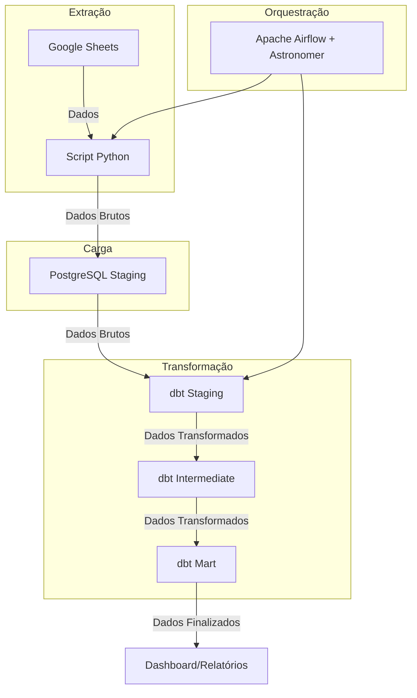

# Pipeline de Dados das Olimpíadas 2024: dbt, PostgreSQL, Airflow e Power BI (Em Construção)

## Visão Geral

Este projeto cria um pipeline de dados para os Jogos Olímpicos de 2024. Utiliza script python para extrair dados de planilhas do Google Sheets, carrega essas informações em um banco de dados PostgreSQL hospedado no Render, e realiza a transformação dos dados utilizando dbt. O Apache Airflow é utilizado para orquestrar o pipeline, e o Power BI para visualização dos dados. O processo de transformação é dividido em camadas: staging, intermediate e mart, preparando os dados para análises detalhadas.

## Arquitetura

1. **Extração de Dados**:
**Objetivo**: Extrair dados de planilhas do Google Sheets e carregar esses dados em um banco de dados PostgreSQL.
**Google Sheets API**: Acesso às planilhas.
**Pandas**: Manipulação e conversão dos dados.
**psycopg2**: Conexão e operação com o PostgreSQL.
**Python**: Realiza a extração e carga dos dados. O script é configurado para buscar novas entradas e evitar duplicação.
**Destino**: PostgreSQL no Render

2. **Transformação de Dados**:
   - **Ferramenta**: dbt
   - **Camadas**:
     - **Staging**: Camada inicial onde os dados são ingeridos diretamente.
     - **Intermediate**: Camada intermediária para limpeza e transformação dos dados.
     - **Mart**: Camada final organizada para relatórios e análises.

3. **Orquestração**:
   - **Ferramenta**: Apache Airflow-Astronomer
   - **Função**: Automatizar e gerenciar o fluxo do pipeline de dados.

4. **Visualização de Dados**:
   - **Ferramenta**: Power BI
   - **Função**: Criar visualizações e relatórios baseados nos dados transformados das Olimpíadas 2024.

## Estrutura do Projeto

- **dags/dbt/pipeline_olympics**: Projeto dbt contendo modelos e macros para as camadas raw, staging e mart.
- **dags/dbt/pipeline_olympics**: Necessário o arquivo "profiles.yml". - Ausente neste repositório por segurança.
- **/dags**: Configuração e DAGs do Apache Airflow para orquestração do pipeline.
- **/dags/config**: deve ficar as credencias do Google Cloud "credencials.json" - Ausente neste repositório por segurança.

## Arquitetura

