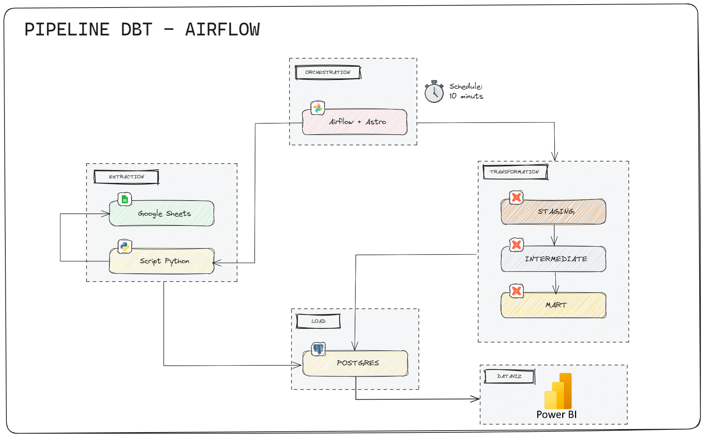

# Pipeline de Dados das Olimpíadas 2024: dbt, PostgreSQL, Airflow e Power BI

## Visão Geral

Este projeto implementa um pipeline de dados para os Jogos Olímpicos de 2024, integrando várias tecnologias para extração, transformação, orquestração e visualização de dados. Os dados são extraídos de planilhas do Google Sheets utilizando um script em Python, carregados em um banco de dados PostgreSQL hospedado no Render, transformados com dbt, orquestrados pelo Apache Airflow, e finalmente visualizados no Power BI. O pipeline de transformação de dados é organizado em camadas (staging, intermediate e mart) para permitir análises detalhadas e otimizadas.

## Arquitetura

1. **Extração de Dados**:
   - **Objetivo**: Extrair dados de planilhas do Google Sheets e carregar no banco de dados PostgreSQL.
   - **Ferramentas e Bibliotecas**:
     - **Google Sheets API**: Para acesso às planilhas.
     - **Pandas**: Manipulação e transformação de dados.
     - **psycopg2**: Conexão e operações com PostgreSQL.
     - **Python**: Utilizado para executar o script de extração e carga, configurado para buscar novas entradas e evitar duplicação de dados.
   - **Destino**: Dados são carregados no PostgreSQL hospedado no Render.

2. **Transformação de Dados**:
   - **Ferramenta**: dbt (data build tool)
   - **Camadas de Transformação**:
     - **Staging**: Dados brutos são ingeridos diretamente na camada staging.
     - **Intermediate**: Camada para limpeza, normalização e transformação intermediária dos dados.
     - **Mart**: Camada final que organiza os dados para relatórios e análises.

3. **Orquestração do Pipeline**:
   - **Ferramenta**: Apache Airflow (Astronomer)
   - **Função**: Automatizar e gerenciar o fluxo de dados entre as etapas de extração, carga e transformação.

4. **Visualização de Dados**:
   - **Ferramenta**: Power BI
   - **Função**: Criação de dashboards e relatórios interativos baseados nos dados transformados dos Jogos Olímpicos de 2024.

## Estrutura do Projeto

- **/dags/dbt/pipeline_olympics**: Projeto dbt contendo modelos, macros e configurações para as camadas de transformação (`staging`, `intermediate`, `mart`).
- **/dags/dbt/pipeline_olympics**: Arquivo de configuração (`profiles.yml`)necessário para o dbt conectar ao PostgreSQL (não incluído no repositório por razões de segurança).
- **/dags**: Contém as DAGs do Apache Airflow para orquestração do pipeline de dados.
- **/dags/config**: Diretório para armazenar as credenciais do Google Cloud (`credentials.json`) necessárias para acessar as planilhas do Google Sheets (não incluído no repositório por razões de segurança).

## Diagrama de Fluxo do Pipeline

  

